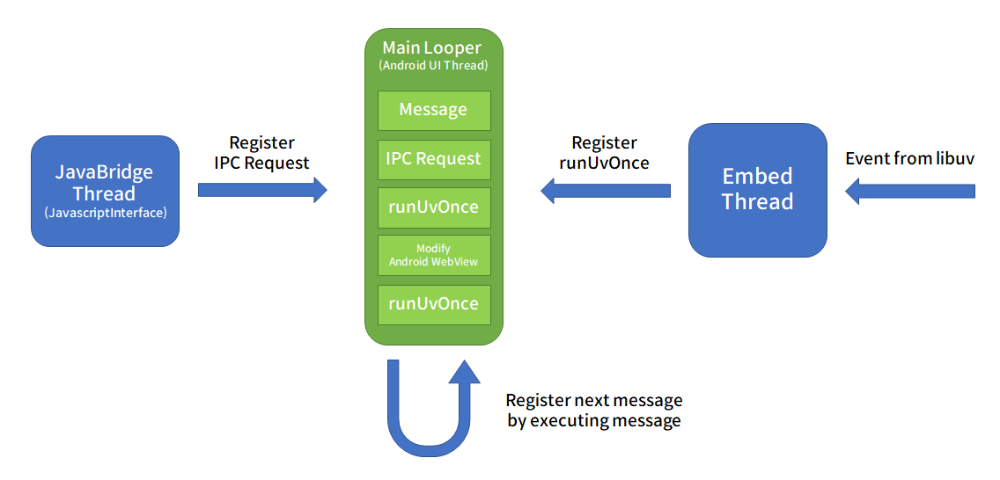

# Electrom
# Architecture



## Classes

### [AndroidContext](https://github.com/doodot/electrom/blob/main/android_app/electron/src/main/cpp/android_context.cpp)
This class manages object ref of Kotlin MainProcess instance and JNI Env of Android UI Thread.
By using this class, Javascript callback function in C++ world can call Kotlin functions.

## Files

### android_app/app/src/main/assets/electron_app
- Actual Javascript source code and asset files for user's electron app.

### android_app/electron/*
- Implementation of Electron API

### android_app/electron/src/main/cpp
#### android_context.cpp
- `CreateWebContents`
    - JNI function which is called by BrowserWindow when constructor tries to create WebView.
- `CommandToWebContents`
    - JNI function for manipluating Android WebView.

#### electron.cpp
- `Java_com_electrom_process_MainProcess_startMainModule`
    - Execute Node embedded enviroment for Electron main process.

### android_app/electron/src/main/java
#### Electron.kt
- Boostrapper for user's electron app.

#### process/MainProcess.kt
- Bridge for Android and Node.js
    - Handle requests from NDK. 

#### process/Webcontents.kt
- Wrapper class for ElectronWebView.

#### view/ElectronWebView.kt
- WebView that satisfies Electron's requirements.
    - Access file protocol url
    - [Ignore CORS](https://chromium.googlesource.com/chromium/src/+/HEAD/android_webview/docs/cors-and-webview-api.md)

#### view/ElectronInterface 
- Javascript interface of Android for providing Electron renderer modules.

## Golas

## Current Goal
- Support only one renderer process
- Implement features in these projects first
    - [x] https://github.com/electron/simple-samples/tree/master/prices

## Not Goal
- webPrefernces options (e.g. Node integration)
    - but, you can use devTools option via chrome `chrome://inspect/#devices`

# Important concepts in Electron
## Wrappable
Wrappable makes relation between C++ instance and JS object.

```cpp
// Skip Isolate for simple code
template <typename T>
class Wrappable {
    v8::Global<v8::Object> wrapper_

    // Actually, this method is GetObjectTemplateBuilder
    virtual Local<Object> CreateWrapper();

    v8::MaybeLocal<v8::Object> GetWrapper() {
        if (!wrapper_.IsEmpty()) {
            return wrapper_;
        }

        // For singleton instance
        wrapper_.Reset(CreateWrapper());
        return v8::MaybeLocal<v8::Object>(wrapper_);
    }

    // For non-singleton instance
    virtual void InitWith(v8::Local<v8::Object> wrapper) {
        wrapper->SetAlignedPointerInInternalField(0, this);
        wrapper_.Reset(wrapper);
    }
}

class App : public Wrappable<App> {
    // Now we can get JS object from instance.
}
```

## TrackableObject
TrackableObject is used to track instance.

```cpp
// Skip Isolate for simple code
template <typename T>
class TrackableObject : public Wrappable<T> {

    TrackableObject() {
        weak_map_id = ++next_id_;
    }

    InitWith(v8::Local<v8::Object> wrapper) {
        Wrappable<TrackableObject>::InitWith(wrapper);
        weak_map_->Set(weak_map_id, wrapper);
    }

    static T* FromWeakMapID(int32_t id) {
        v8::MaybeLocal<v8::Object> object = weak_map->Get(id);
        if (object.IsEmpty())
            return nullptr;

        T* self = nullptr;
        gin::ConvertFromV8(object.ToLocalChecked(), &self);
        return self;
    }

    int32_t weak_map_id_;

    static WeakMap<int32_t>* weak_map_;

    static int32_t next_id_ = 0;
}

class BrowserWindow : public TrackableObject<BrowserWindow> {
    // Now we can track instance by id and get JS object from instance.
}
```

# How Electron loads modules
## Internal `require('electron')`
Electron loads internal code before executing `MainStartupScript`.

Electron uses js2c in Node.js for embedding javascript code into C++ binary.

Electron uses Webpack to merge `lib/browser/**/*.ts` into single file `browser_init.js`. 
When Webpack compiles these files, it transforms `require('electron')` 
to `require('lib/browser/api/exports/electron.ts')` because of [Webpack config](https://github.com/electron/electron/blob/main/build/webpack/webpack.config.base.js) files in Electron.

## MainStartupScript `require('electron')`
```js
// If you start this code with `electron app.js`
// This code will return Electron modules.

// If you start this code with `node app.js`
// This code will return path of electron binary.
require('electron')
```

`browser_init.js` manipulates `Module` (in `require('module'`).

`Module` manages search path of `require` function and cache of Node.js libraries.

[lib/common/reset-search-path.ts](https://github.com/electron/electron/blob/main/lib/common/reset-search-paths.ts) adds Electron modules in `lib/browser/api/exports/electron.ts` into Module's cache with keys; (`'electron'`, `'electron/main'`).
